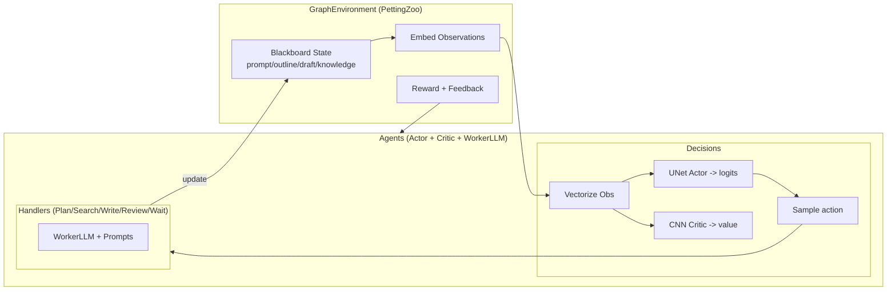

# Related Work Generator (RWG)

RWG is a multi-agent reinforcement-learning system that collaborates on a shared blackboard to draft the Related Work section of a research paper. Planning, retrieval, writing, and reviewing are assigned to distinct agents, and a combination of PettingZoo parallel environments, LLM tooling, and embedding models coordinates their interactions to improve the draft over multiple rounds.

## Core Components
- **Environment (`src/rl_env/graph.py`)**: `GraphEnvironment` exposes observations, schedules actions, and computes rewards based on a Blackboard containing the prompt, outline, draft, knowledge DB, and review history.
- **Agents (`src/agent/nodes.py`)**: Each agent bundles a UNet-style Actor (producing discrete action logits) and a CNN Critic (predicting state value). Observations concatenate several semantic embeddings plus the previous feedback signal.
- **Action Handlers (`src/agent/action.py`)**: PLAN/SEARCH/WRITE/REVIEW/WAIT actions invoke prompt templates and the shared `WorkerLLM` to generate outlines, search queries, draft paragraphs, or critiques, updating the Blackboard accordingly.
- **LLM Tooling (`src/agent/model.py`)**: Loads `Qwen/Qwen2-1.5B` (or any other Hugging Face model) so action handlers can request text generation and JSON-style scoring.
- **Reward Shaping**: Non-WAIT actions incur a small cost, while planning, search, writing, and review provide specific bonuses. Review additionally rewards the LLM’s self-score to reflect draft quality.

## Algorithm Flow
1. **Environment Reset**: Initialize the Blackboard from the task prompt/paper info and embed initial observations via SentenceTransformer.
2. **Parallel Decisions**: Every agent tensorizes its observation, samples an action through its Actor, and obtains a value estimate from the Critic for downstream RL objectives.
3. **Action Execution**: The environment dispatches each action to its handler, possibly triggering LLM prompts, knowledge-base updates, or draft extensions.
4. **Feedback & Rewards**: Actions, rewards, and review feedback are logged; `feedback_cache` is updated so next-round observations reflect the latest critique.
5. **Episode Iteration**: Repeat until `MAX_ROUNDS` or all agents finish, then print a preview of the final draft.

## Interaction Diagram


## Entry Point
```bash
uv run python -m src.main
```
The script prints each step’s actions, rewards, and draft snapshot so you can observe the collaborative writing dynamics. Adjust the task or model in `src/main.py` and `src/config.py` as needed.
